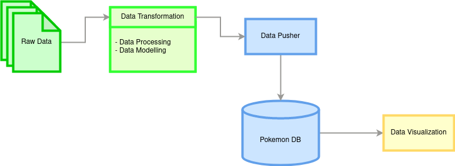

# Pokemon Analysis

## High Level Diagram

There are 3 parts to this project:
- Data Transformation
- Data Pusher
- Data Visualization

### Data Transformation
Transformed the two data sets into 3 dataframes:
- pokemon dataframe (pk: pokedex_number)
- pokemon forms dataframe (pk: no pk)
- pokemon types dataframe (pk: types)

### Data Pusher
- Run a psql database using docker.
- Writing a python code to push the transformed data.

### Data Visualization

## Datasets
- [Dataset 1](https://www.kaggle.com/datasets/mariotormo/complete-pokemon-dataset-updated-090420)
- [Dataset 2](https://www.kaggle.com/datasets/jadenbailey/pokemon-type-chart?select=typing_chart.csv)